# O projeto 📚

Projeto base automação de testes com Cypress 9 e Cucumber.

# Dependências 💾

Foi utilizado:
* Cypress 9.7.0
* Cucumber preprocessor

# Como iniciar um projeto de automação com Cypress 9 e Cucumber ✍

**Passo 1:** iniciar um projeto NodeJS<br>
Basta digitar o comando abaixo no terminal:<br>
`$ npm init`

Criará o arquivo `package.json`.

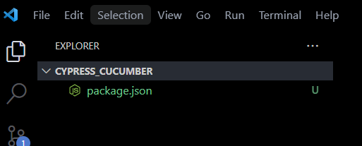

**Passo 2:** instalar o Cypress 9<br>
`npm i cypress@9.7.0`

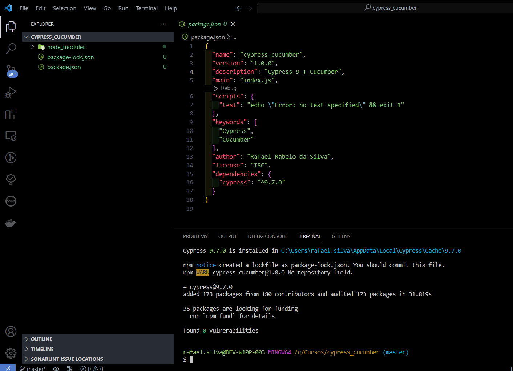

**Passo 3:** instalar o Cucumber<br>
`npm install --save-dev cypress cypress-cucumber-preprocessor`

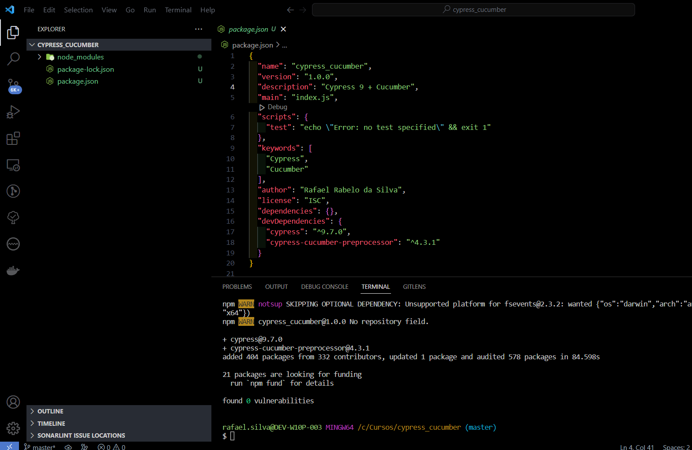

Se seu VSCode exibir esta mensagem você pode clicar em "Sim". Isto apenas irá criar um arquivo `.gitignore` que irá desconsiderar os módulos node nos seus commits.

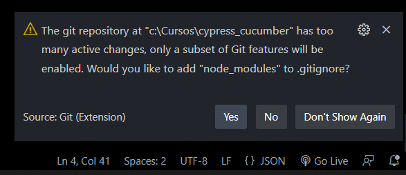

**Passo 4:** abrir o cypress para ele criar o restante das pastas<br>
`npx cypress open`<br>

A pasta `cypress` será criada. O cypress pode ser fechado pois não será usado ainda.

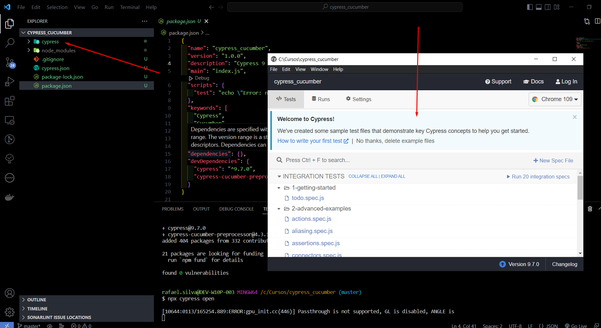

**Passo 5:** adicionar o script abaixo no arquivo `index.js`

cypress/plugins/index.js
```
const cucumber = require("cypress-cucumber-preprocessor").default;
module.exports = (on) => {
        on("file:preprocessor", cucumber());

};

```

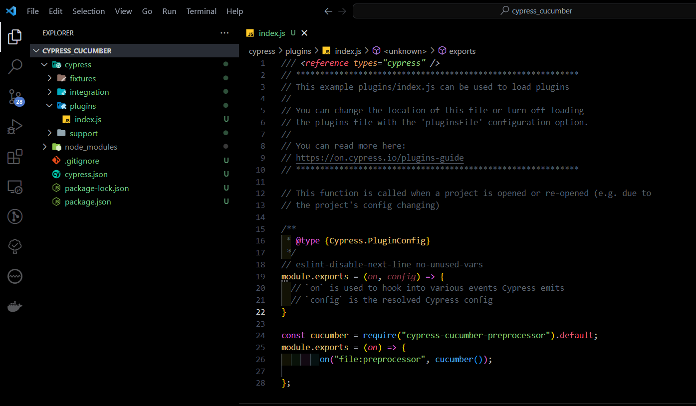

**Passo 6:** criar pastas extras para os testes<br>
Criar pastas: elements, pageObjects e steps.

* cypress/support/elements
* cypress/support/pageObjects
* cypress/support/steps

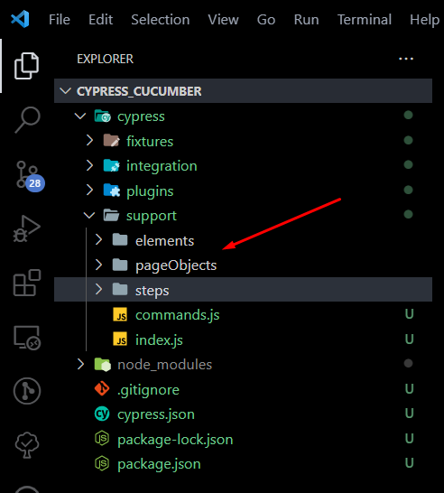

**Passo 7:** adicionar o código abaixo no arquivo `package.json`

```
{
    "scripts": {
        "test": "cypress run --browser chrome"
    },
    "cypress-cucumber-preprocessor": {
        "step_definitions": "cypress/support/steps"
    }
}
```

O meu ficou da seguinte mandeira:

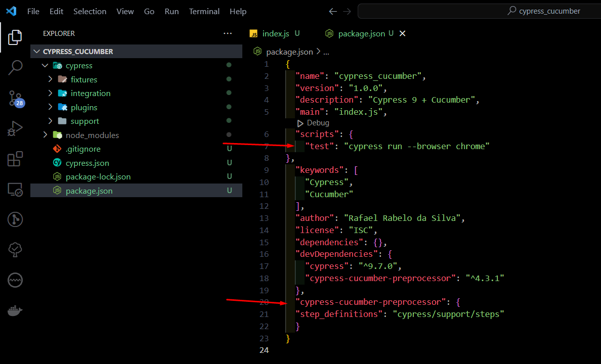

**Passo 8:** adicionar o código abaixo no arquivo `cypress.json`
Ele informa a resolução do navegador que será usado nos testes, timeout e a URL base (que é a URL dos testes). Você pode modificar este arquivo como desejar.

```
{
    "viewportWidth": 1366,
    "viewportHeight": 768,
    "defaultCommandTimeout": 10000,
    "baseUrl": "https://www.ultima.school/"
}
```

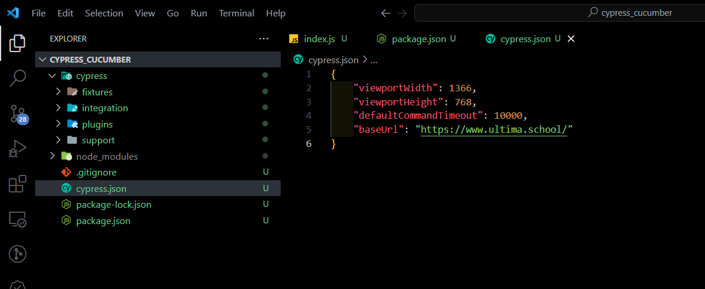

**Passo 9:** criar o cenário de teste em BDD<br>
Criar um arquivo `.feature` com os testes em BDD. Você pode usar o abaixo como base:

cypress/integration/Login.feature
```
Feature: Login site ULTIMA

    Scenario: Visualizar opção de login
        Given acesso o site ultima
        When acesso a pagina de login
        Then devo visualizar botao de conecte
```

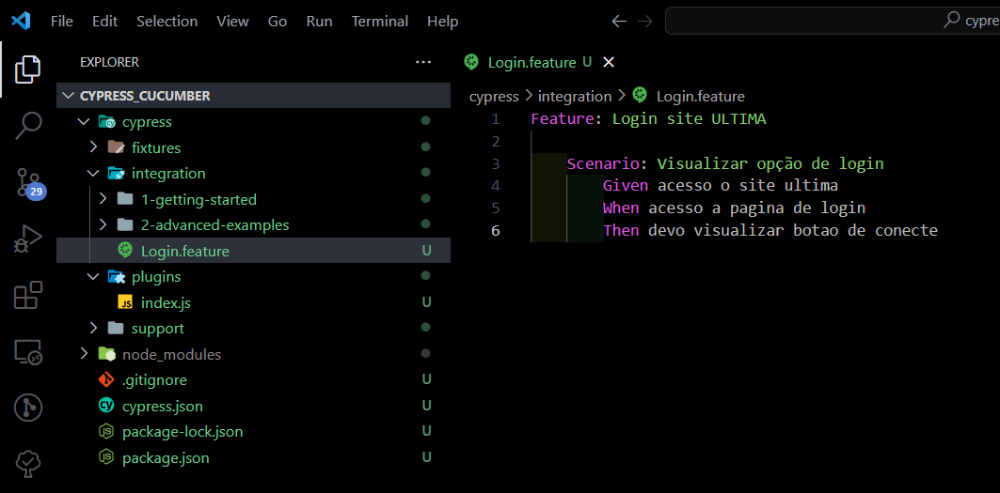

Você pode deletar essas duas pastas do cypress (getting-started e advanced-exemples) pois no modo headless (se não for informado qual arquivo de teste deseja executar) será executado os testes dessas pastas também:

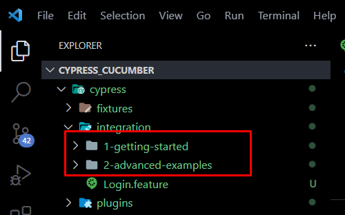

**Passo 10:** criar arquivo `.js` que terá os passos do teste<br>
Você pode usar este como base, o nome do meu arquivo é `LoginPage.js`:

cypress/support/steps/LoginPage.js
```
/* global Given, Then, When */

import LoginPage from '../pageobjects/LoginPage'
const loginPage = new LoginPage

Given("acesso o site ultima", () => {
    loginPage.acessarSite();
})

When("acesso a pagina de login", () => {
    loginPage.abraPaginaLogin();
})

Then("devo visualizar botao de conecte", () => {
    loginPage.visualizarBotaoCadastro();
})
```

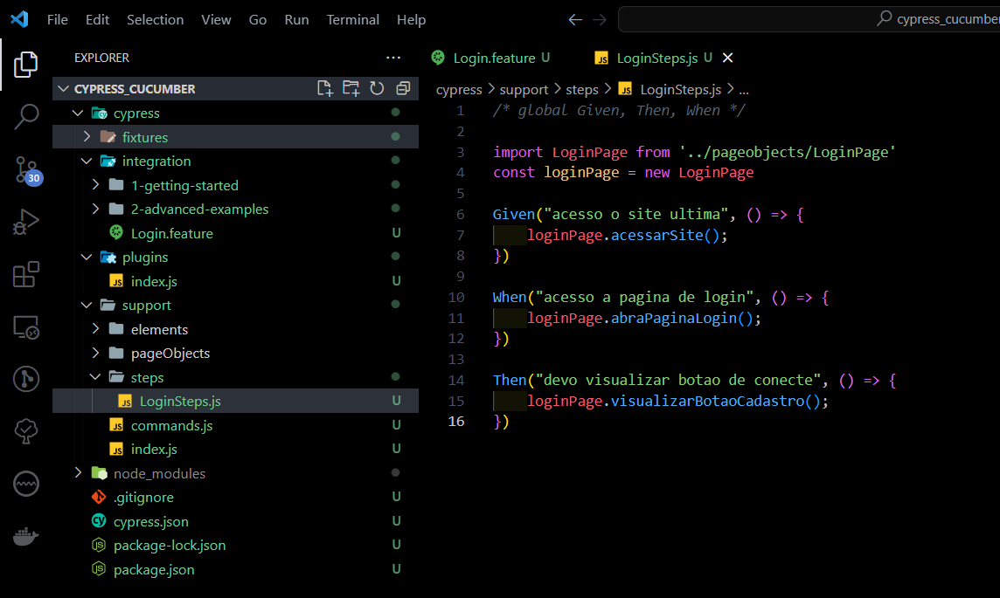

**Passo 11:** criar arquivo `.js` com os comandos e funções que executamos nos testes<br>
Você pode usar este como base, o nome do meu arquivo é `LoginPage.js`:

cypress/support/pageObjects/LoginPage.js
```
import LoginElements from '../elements/LoginElements'
const loginElements = new LoginElements
const url = Cypress.config("baseUrl")

class LoginPage {
    // Acessa o site que será testado
    acessarSite() {
        cy.visit(url)
    }

    // Clica no botão que acessa a página de login do site
    abraPaginaLogin() {
        cy.visit(loginElements.botaoLogin())
    }

    // Verifica se o botão tem o texto "Esqueceu sua senha?"
    visualizarBotaoCadastro() {
        //    cy.get(loginElements.botaoConecte()).should('Conecte-se')

        cy.get(loginElements.botaoConecte())
            .invoke('attr', 'value')
            .should('eq', 'Conecte-se')
    }
}

export default LoginPage;
```

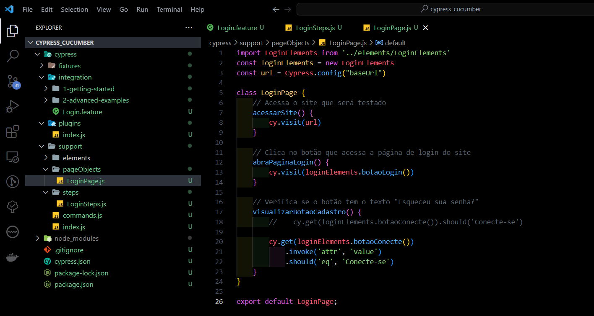

**Passo 12:** criar arquivo `.js` com os elementos da página dos testes
Você pode usar este como base, o nome do meu arquivo é `LoginElements.js`:

cypress/support/elements/LoginElements.js
```
class LoginElements {
    botaoLogin = () => { return 'https://edu.ultima.school/lgn/' }

    campoLogin = () => { return 'user_login' }

    campoSenha = () => { return 'user_pass' }

    botaoConecte = () => { return '#wp-submit' }
}

export default LoginElements;
```
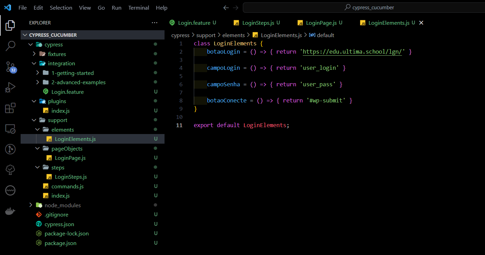

**Passo 13:** executar os testes<br>
Você pode executar de 2 maneiras:

* Modo headless (sem interface):
`npm run test Login.feature`

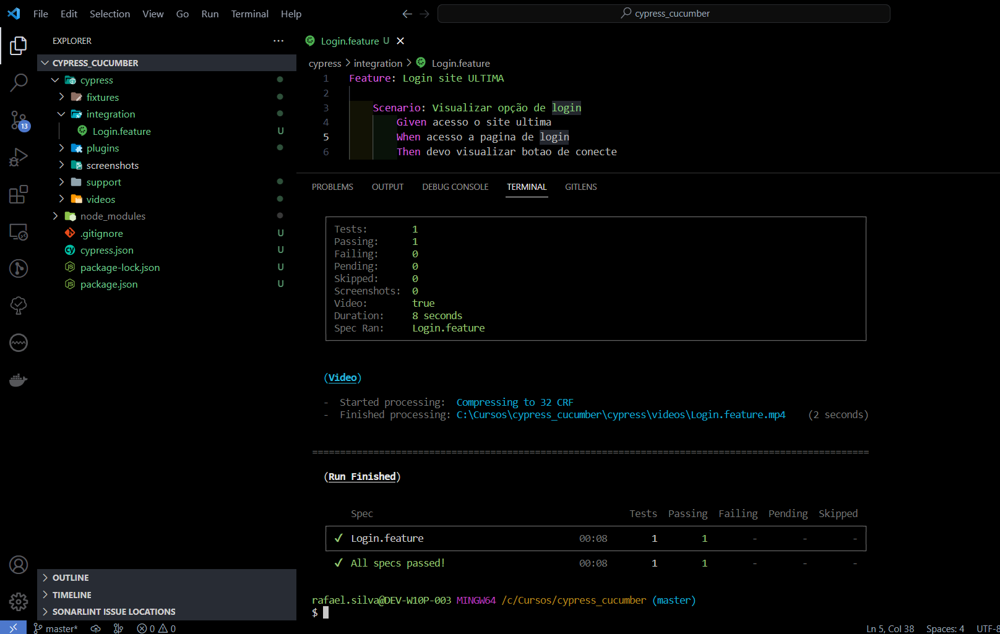

* Modo com interface do cypress:
`npx cypress open`

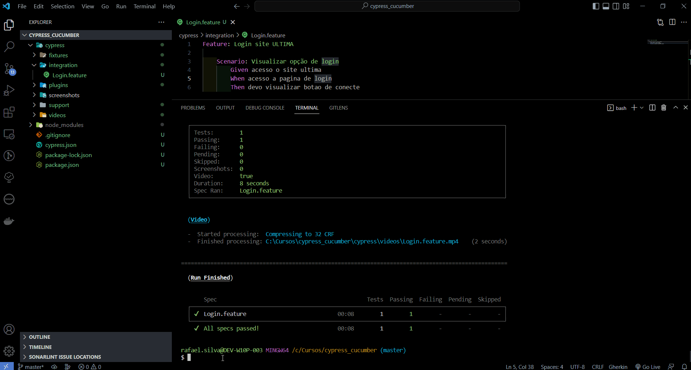